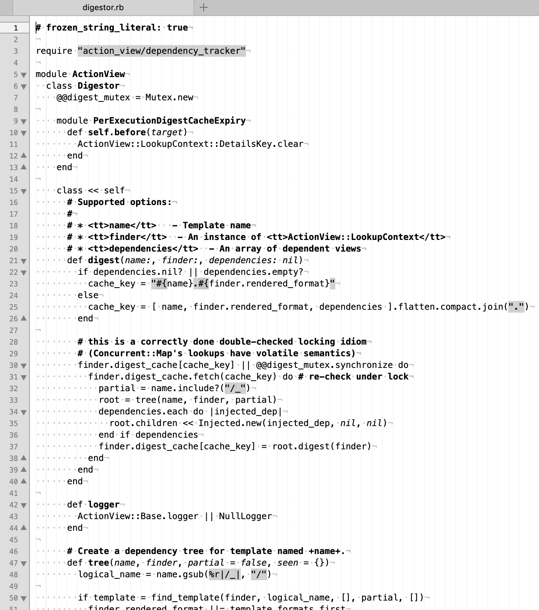

# Minimal TextMate Theme

This is my minimalistic syntax coloring theme for [TextMates](https://macromates.com).

I've found that for me, most syntax coloring schemes hinders reading more than it helps, and I suspect a majority of them are designed to look pretty but without much if any thought given to *why* different different colors and styles are applied. This one is designed with one primary goal in mind:  To help quickly navigating the source code by treating class, methods and function names as well as comments[1] as *headlines* by setting them in bold face. It does a few more things, but those are secondary, and frankly I'm not so sure if I didn't fall victim myself to "but it looks pretty!"-disease.

[1] Yes, comments. Some people, I've noticed, perceive comments to be a form of noise, and prefer when they are de-emphasized. I feel the opposite way: I want comments to be *more* prominent than the code. Comments are there as a help, and are meant to  be read *before* the code. If comments annoy you, and seem like noise, maybe there's something wrong with the comments, and instead of making them easier to ignore, you should rewrite or delete them.

## Install

Download or clone this repository and double click the `tmTheme` files. Or if you use SublimeText, you could clone this repository to your `Sublime Text/Packages` folder.

## License

[MIT](./LICENSE)
